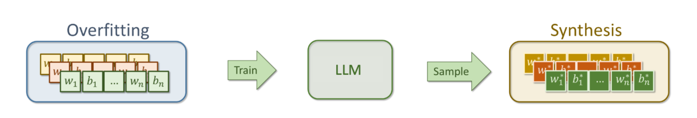
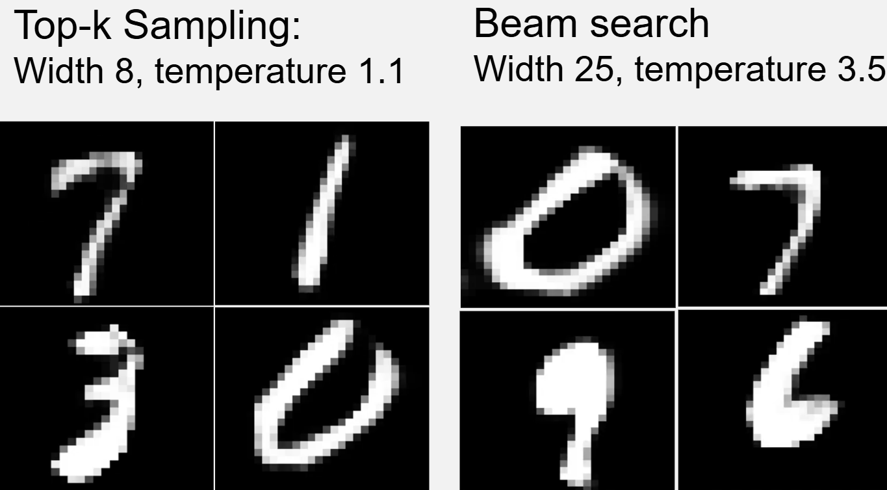

# INR-Autoregressive
### Autoregressive Modeling of Implicit Neural Representations (INRs) with GPT-Style Transformers

Modeling **Implicit Neural Representations (INRs)** as token sequences using an autoregressive transformer, enabling direct generation of neural network parameters without diffusion.

<p align="center">
  
</p>

## Overview

This project explores an autoregressive framework for generating **Implicit Neural Representations (INRs)** by treating neural network parameters as discrete token sequences.

While most recent INR generation approaches rely on **diffusion models**, this work instead leverages the sequence modeling capabilities of **GPT-style transformers**. Continuous weights and bias terms are discretized into a finite vocabulary, allowing the model to learn the underlying structure of neural networks and autoregressively generate complete functional representations.

The result is a compact and expressive generative model capable of synthesizing neural network parameters token-by-token, analogous to how language models generate text.

## Key Features

- 🧠 GPT-style autoregressive transformer for INR generation
- 🔢 Weight-level and neuron-level tokenization
- 📦 Quantized weight vocabulary using configurable discretization
- ✂️ Structural delimiter tokens to preserve network topology
- 📈 Multiple decoding strategies
  - Argmax
  - Beam Search
  - Top-K Sampling
- 📊 Evaluation using LeNet and Inception metrics
- ⚡ Ready-to-use pretrained checkpoint included for immediate experimentation

## Setup

### 1. Clone the Repository

```bash
git clone https://github.com/TheSeekerOfTruth/inr-autoregressive.git
cd inr-autoregressive
```

### 2. Create a Conda Environment

Python **3.9+** is recommended.

```bash
conda create -n neural-graphs python=3.9 -y
conda activate neural-graphs
```

### 3. Install Dependencies

```bash
pip install -r requirements.txt
```

## Data Preparation

The preprocessing pipeline converts continuous INR parameters into discrete token sequences suitable for transformer training.

Run

```bash
python -m src.utils.prepare_data
```

### Tokenization

The tokenizer removes permutation ambiguity by

- sorting neuron weights
- associating each bias with its corresponding neuron
- optionally tokenizing at either
  - **Weight Level**
  - **Neuron Level** (incoming weights + bias)

### Discretization

Continuous parameters are mapped into a finite vocabulary using configurable binning strategies.

Supported methods include

- Quantile Binning
- Uniform Binning

A unique delimiter token is inserted between neurons to preserve structural information throughout the sequence.

## Configuration

All experiment settings are controlled through

```text
config.yaml
```

### Model Configuration

Defines the transformer architecture, including

- embedding dimension
- hidden size
- number of transformer layers
- number of attention heads
- sequence length
- vocabulary size

### Training Parameters

Controls optimization settings such as

- learning rate
- batch size
- epochs
- checkpoint saving

Modify `config.yaml` before starting a new experiment.

## Training

Training is performed through

```text
notebooks/training.ipynb
```

The notebook includes

- training visualization
- validation
- loss curves

The main training loop is implemented in

```text
train.py
```

## Pretrained Checkpoint

A pretrained model is provided in the **`checkpoints/`** directory.

This allows you to immediately

- generate new INRs
- evaluate the pretrained model
- compare decoding strategies
- reproduce qualitative results

without training from scratch.

Simply load the provided checkpoint inside `evaluation.ipynb` and begin experimenting.

## Evaluation

The repository includes several notebooks for evaluating generated INRs.

| Notebook | Description |
|----------|-------------|
| **evaluation.ipynb** | Generate digits using different decoding strategies |
| **lenet_scores.ipynb** | Evaluate generated digits using a custom LeNet trained on MNIST |
| **inception_scores.ipynb** | Compute Inception Scores for comparison (less reliable for MNIST) |

## Decoding Strategies

### Argmax

Deterministically selects the highest-probability token at every step.

Ideal for

- reproducibility
- high-confidence outputs

### Beam Search

Maintains multiple candidate sequences throughout generation.

Produces

- more coherent outputs
- globally better token sequences

### Top-K Sampling

Samples from the **K** most probable tokens.

Produces

- diverse generations
- greater variability
- exploration of the learned distribution

## Results

### Generated Samples

<p align="center">
  
</p>

*Example digits generated autoregressively from the pretrained GPT model.*

## Workflow

```text
Prepare INR Dataset
        │
        ▼
Tokenize & Discretize
        │
        ▼
Train GPT Transformer
        │
        ▼
Load Pretrained Checkpoint
        │
        ▼
Generate INR Tokens
        │
        ▼
Decode Neural Network
        │
        ▼
Evaluate Generated Digits
```

## Acknowledgements

This project investigates autoregressive modeling as an alternative to diffusion-based INR generation, drawing inspiration from the success of large language models in sequential prediction and discrete token modeling.